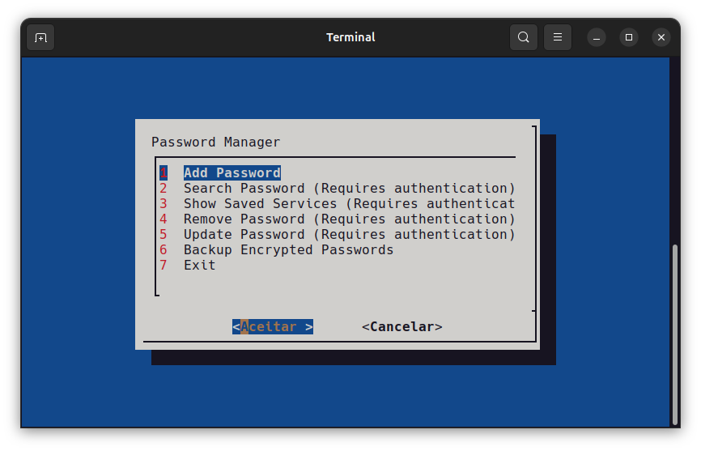

# Password Manager

This is a simple script for password management, where you can add, search, remove, and update passwords for different services securely. The system uses AES-256 encryption to protect the passwords, and a master password is required to access and perform operations.

## Installation and Configuration

To make it easier to use, it is recommended to create an alias for the script, so you can call it from anywhere in the terminal.

### 1. Create an alias

Add the following alias to your `~/.bashrc` or `~/.zshrc` file, depending on the shell you use. This allows you to run the script with a simple command from any directory:

```bash
alias password_manager='/path/to/password_manager.sh'
```

Replace `/path/to/password_manager.sh` with the full path to the script. For example, if the script is in your `~/scripts` folder, the line will look like this:

```bash
alias password_manager='~/scripts/password_manager.sh'
```

After adding the alias, run the following command to reload the shell configuration file:

```bash
source ~/.bashrc  # or source ~/.zshrc
```

Now, you can call the script from anywhere with the command:

```bash
password_manager
```

### 2. Making the script executable

Make sure the script has execution permissions. To do this, run the following command:

```bash
chmod +x /path/to/password_manager.sh
```

Now, the script is ready to be executed!

## Features

- **Add password**: Allows you to add a new password for a service.
- **Search password**: Allows you to search for a specific service’s password.
- **Show saved services**: Displays all services whose passwords are stored.
- **Remove password**: Allows you to remove a password for a specific service.
- **Update password**: Updates the password for a service.
- **Backup**: Creates a backup of the encrypted password file.

## How to use

1. **Run the script**: To start using the password manager, run the script in a terminal:

    ```bash
    password_manager
    ```

2. **Master password**: When prompted, enter your master password to generate the encryption key.

3. **Main menu**: The main menu will appear with options to manage your passwords.

    * "Add password"
    * "Search password"
    * "Show saved services"
    * "Remove password"
    * "Update password"
    * "Backup"
    * "Exit"

    

4. **Operations**: 
    - To add a password, select "Add password" and enter the requested information (service name, username, and password).
        
    - To search for a password, select "Search password", enter the service name, and the password will be displayed.
    
    - To view all saved services, select "Show saved services" and a list will be displayed.
    
    - To remove a password, select "Remove password" and provide the service name to delete.
    
    - To update a password, select "Update password", enter the service name, and the new password.

5. **Backup**: To create a backup of the password file, select "Backup". This will create a copy of the encrypted password file.

6. **Exit**: To exit the script, select "Exit" from the menu.

## Requirements

- `dialog`: For the terminal graphical interface.
- `openssl`: For encrypting and decrypting the passwords.

## License

This project is open-source and distributed under the [MIT License](LICENSE.txt).

---